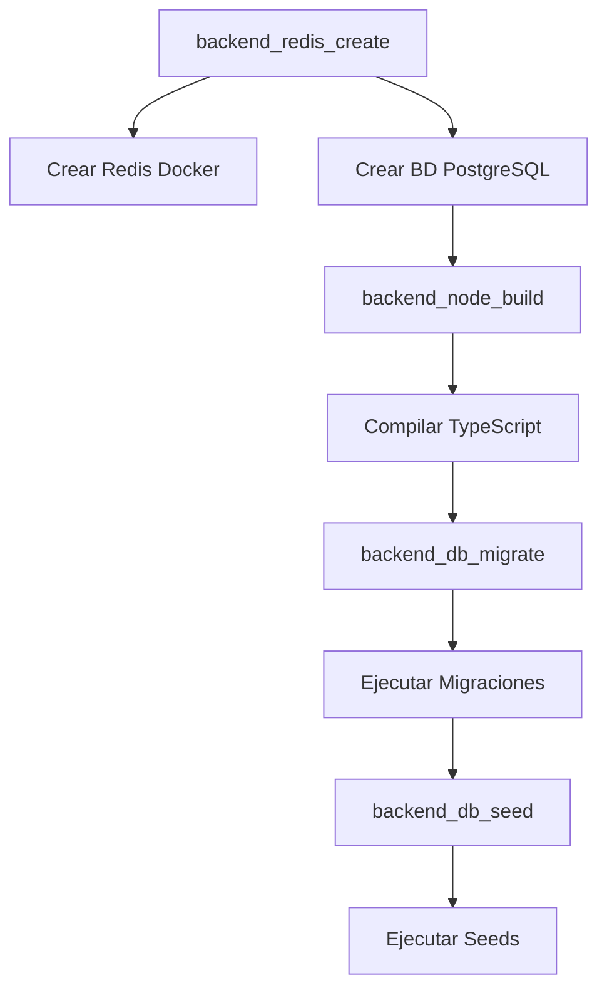

# Guía de Instalación y Troubleshooting - Chasap v2.0

## 📋 Índice

1. [Sistema de Logs](#sistema-de-logs)
2. [Revisión del Instalador](#revisión-del-instalador)
3. [Proceso de Base de Datos](#proceso-de-base-de-datos)
4. [Solución de Problemas Comunes](#solución-de-problemas-comunes)
5. [Verificación Post-Instalación](#verificación-post-instalación)

---

## 1. Sistema de Logs

### 📝 Ubicación de Logs

El instalador mejorado guarda logs en:
```
/var/log/chasap-install/install-YYYYMMDD-HHMMSS.log
```

### Ver Logs en Tiempo Real

**Durante la instalación** (en otra terminal):
```bash
# Conectar al servidor
ssh root@tu-servidor

# Ver log en tiempo real
sudo tail -f /var/log/chasap-install/install-*.log
```

### Ver Logs Después de la Instalación

```bash
# Listar todos los logs de instalación
ls -lh /var/log/chasap-install/

# Ver el log más reciente
cat /var/log/chasap-install/$(ls -t /var/log/chasap-install/ | head -1)

# Buscar errores en el log
grep -i "error" /var/log/chasap-install/install-*.log

# Buscar una fase específica
grep -i "Fase 4" /var/log/chasap-install/install-*.log
```

### Logs de la Aplicación (PM2)

```bash
# Ver logs del backend
pm2 logs {instancia}-backend

# Ver logs del frontend
pm2 logs {instancia}-frontend

# Ver todos los logs
pm2 logs

# Guardar logs a archivo
pm2 logs --out /tmp/pm2-logs.txt
```

### Logs del Sistema

```bash
# Logs de Nginx
sudo tail -f /var/log/nginx/error.log
sudo tail -f /var/log/nginx/access.log

# Logs de PostgreSQL
sudo tail -f /var/log/postgresql/postgresql-*-main.log

# Logs de Docker (Redis)
sudo docker logs redis-{instancia}
```

---

## 2. Revisión del Instalador

### Mejoras Aplicadas

#### ✅ Script Principal (`setup`)

**Cambios realizados**:
1. ✅ Sistema de logging completo
2. ✅ Manejo de errores en cada fase
3. ✅ Mensajes informativos por fase
4. ✅ Verificación de éxito/fallo de cada paso
5. ✅ Resumen final con credenciales

**Fases de instalación**:
```
Fase 1: Actualización del sistema
Fase 2: Instalación de dependencias
Fase 3: Configuración del sistema
Fase 4: Configuración del Backend
Fase 5: Configuración del Frontend
Fase 6: Configuración de Red
```

#### ✅ Creación de Base de Datos (`_backend.sh`)

**Problema anterior**:
```bash
# Comandos anidados incorrectamente
sudo su - postgres <<EOF
  createdb ${instancia_add};
  psql  # ← Esto abría una sesión interactiva
  CREATE USER...  # ← Nunca se ejecutaba
EOF
```

**Solución aplicada**:
```bash
# Comandos SQL correctos en un solo bloque
sudo -u postgres psql <<EOF
CREATE DATABASE ${instancia_add};
CREATE USER ${instancia_add} WITH SUPERUSER INHERIT CREATEDB CREATEROLE;
ALTER USER ${instancia_add} PASSWORD '${mysql_root_password}';
GRANT ALL PRIVILEGES ON DATABASE ${instancia_add} TO ${instancia_add};
EOF
```

### Datos que Solicita el Instalador

Durante la ejecución, el instalador pedirá:

1. **Contraseña** (para usuario deploy y base de datos)
   - Solo letras y números
   - Se usa para: usuario deploy, PostgreSQL, Redis

2. **Nombre de instancia**
   - Solo letras minúsculas y números
   - Ejemplo: `empresa1`, `chasap01`

3. **Límites**
   - Máximo de usuarios
   - Máximo de conexiones WhatsApp

4. **Dominios**
   - URL del backend: `https://backend.tudominio.com`
   - URL del frontend: `https://frontend.tudominio.com`

5. **Email**
   - Para certificado SSL de Let's Encrypt

---

## 3. Proceso de Base de Datos

### Orden de Ejecución



### 1. Creación de Redis (Docker)

```bash
# Comando ejecutado
docker run --name redis-{instancia} \
  -p {redis_port}:6379 \
  --restart always \
  --detach redis \
  redis-server --requirepass {password}
```

**Verificar**:
```bash
# Ver contenedor
sudo docker ps | grep redis

# Probar conexión
sudo docker exec -it redis-{instancia} redis-cli -a {password} ping
# Debe responder: PONG
```

### 2. Creación de Base de Datos PostgreSQL

```bash
# Comandos ejecutados
CREATE DATABASE {instancia};
CREATE USER {instancia} WITH SUPERUSER INHERIT CREATEDB CREATEROLE;
ALTER USER {instancia} PASSWORD '{password}';
GRANT ALL PRIVILEGES ON DATABASE {instancia} TO {instancia};
```

**Verificar**:
```bash
# Listar bases de datos
sudo -u postgres psql -c "\l"

# Conectar a la base de datos
sudo -u postgres psql -d {instancia}

# Ver tablas (después de migración)
\dt

# Salir
\q
```

### 3. Compilación del Backend

```bash
# Comando ejecutado
cd /home/deploy/{instancia}/backend
npm run build
```

**Verificar**:
```bash
# Verificar que existe carpeta dist
ls -la /home/deploy/{instancia}/backend/dist

# Verificar archivos compilados
ls -la /home/deploy/{instancia}/backend/dist/config/
ls -la /home/deploy/{instancia}/backend/dist/database/migrations/
ls -la /home/deploy/{instancia}/backend/dist/database/seeds/
```

### 4. Ejecución de Migraciones

```bash
# Comando ejecutado
cd /home/deploy/{instancia}/backend
npx sequelize db:migrate
```

**Verificar**:
```bash
# Ver tabla de migraciones
sudo -u postgres psql -d {instancia} -c "SELECT * FROM \"SequelizeMeta\";"

# Ver tablas creadas
sudo -u postgres psql -d {instancia} -c "\dt"

# Debe mostrar tablas como:
# - Companies
# - Users
# - Whatsapps
# - Tickets
# - Messages
# - etc.
```

### 5. Ejecución de Seeds

```bash
# Comando ejecutado
cd /home/deploy/{instancia}/backend
npm run db:seed
```

**Verificar**:
```bash
# Ver datos insertados
sudo -u postgres psql -d {instancia} -c "SELECT * FROM \"Companies\";"
sudo -u postgres psql -d {instancia} -c "SELECT * FROM \"Users\";"
sudo -u postgres psql -d {instancia} -c "SELECT * FROM \"Plans\";"

# Debe mostrar:
# - 1 Company (Empresa 1)
# - 1 User (admin@admin.com)
# - 1 Plan (Plano 1)
```

---

## 4. Solución de Problemas Comunes

### Error: "Cannot find module bootstrap"

**Síntoma**:
```
ERROR: Error reading "dist/config/database.js"
[ERR_MODULE_NOT_FOUND]: Cannot find module '/home/deploy/.../dist/bootstrap'
```

**Solución**:
```bash
# Ya está corregido en el repositorio
# Si tienes versión antigua, actualizar:
cd /home/deploy/{instancia}
git pull origin main
cd backend
npm run build
```

**Ver**: `FIX_DATABASE_CONFIG.md`

### Error: Seeds Fallan

**Síntoma**:
```
ERROR: Cannot find module 'dist/database/seeds/...'
```

**Solución**:
```bash
# Usar npm run db:seed en lugar de npx sequelize
cd /home/deploy/{instancia}/backend
npm run db:seed
```

**Ver**: `FIX_MIGRACION_SEEDS.md`

### Error: PostgreSQL - Database Already Exists

**Síntoma**:
```
ERROR: database "{instancia}" already exists
```

**Solución**:
```bash
# Opción 1: Eliminar y recrear (CUIDADO: borra datos)
sudo -u postgres psql -c "DROP DATABASE {instancia};"
sudo -u postgres psql -c "CREATE DATABASE {instancia};"

# Opción 2: Continuar con la existente
# El instalador ahora maneja esto automáticamente
```

### Error: Redis Container Already Exists

**Síntoma**:
```
docker: Error response from daemon: Conflict. The container name "/redis-{instancia}" is already in use
```

**Solución**:
```bash
# Opción 1: Eliminar contenedor existente
sudo docker stop redis-{instancia}
sudo docker rm redis-{instancia}

# Opción 2: Usar el existente
# El instalador ahora maneja esto automáticamente
```

### Error: PM2 No Inicia

**Síntoma**:
```
[PM2][ERROR] Process failed to start
```

**Solución**:
```bash
# Ver logs detallados
pm2 logs {instancia}-backend --lines 100

# Verificar .env
cat /home/deploy/{instancia}/backend/.env

# Verificar que dist/ existe
ls -la /home/deploy/{instancia}/backend/dist/

# Reintentar
pm2 delete {instancia}-backend
pm2 start /home/deploy/{instancia}/backend/dist/server.js --name {instancia}-backend
```

### Error: Nginx 502 Bad Gateway

**Síntoma**:
Al acceder al frontend/backend, aparece error 502.

**Solución**:
```bash
# Verificar que PM2 está corriendo
pm2 status

# Verificar logs de Nginx
sudo tail -f /var/log/nginx/error.log

# Verificar configuración de Nginx
sudo nginx -t

# Reiniciar Nginx
sudo systemctl restart nginx
```

---

## 5. Verificación Post-Instalación

### Checklist Completo

```bash
# 1. Verificar PostgreSQL
sudo systemctl status postgresql
sudo -u postgres psql -c "\l" | grep {instancia}

# 2. Verificar Redis
sudo docker ps | grep redis
sudo docker exec -it redis-{instancia} redis-cli -a {password} ping

# 3. Verificar PM2
pm2 status
# Debe mostrar:
# - {instancia}-backend: online
# - {instancia}-frontend: online

# 4. Verificar Nginx
sudo systemctl status nginx
sudo nginx -t

# 5. Verificar certificados SSL
sudo certbot certificates

# 6. Verificar datos en BD
sudo -u postgres psql -d {instancia} -c "SELECT COUNT(*) FROM \"Users\";"
# Debe mostrar: 1

# 7. Probar acceso web
curl -I https://frontend.tudominio.com
# Debe responder: 200 OK
```

### Acceso a la Aplicación

1. **Abrir navegador**: `https://frontend.tudominio.com`
2. **Login**:
   - Email: `admin@admin.com`
   - Contraseña: `123456`
3. **Cambiar contraseña inmediatamente**

### Comandos Útiles

```bash
# Ver logs en tiempo real
pm2 logs

# Reiniciar servicios
pm2 restart all

# Ver uso de recursos
pm2 monit

# Guardar configuración PM2
pm2 save

# Ver info de proceso
pm2 info {instancia}-backend

# Ver variables de entorno
pm2 env {instancia}-backend
```

---

## 📞 Soporte

Si los problemas persisten:

1. **Revisar logs**:
   ```bash
   cat /var/log/chasap-install/install-*.log
   pm2 logs
   ```

2. **Recopilar información**:
   ```bash
   # Crear reporte
   {
     echo "=== Sistema ==="
     uname -a
     lsb_release -a
     
     echo "=== PostgreSQL ==="
     sudo -u postgres psql --version
     sudo systemctl status postgresql
     
     echo "=== PM2 ==="
     pm2 status
     
     echo "=== Nginx ==="
     nginx -v
     sudo nginx -t
     
     echo "=== Docker ==="
     sudo docker ps
   } > /tmp/chasap-debug.txt
   
   cat /tmp/chasap-debug.txt
   ```

3. **Abrir issue en GitHub** con el reporte

---

## 📚 Documentación Adicional

- `FIX_DATABASE_CONFIG.md` - Fix para error de bootstrap
- `FIX_MIGRACION_SEEDS.md` - Fix para error de seeds
- `RESUMEN_INTEGRACION_MULTICANAL.md` - Detalles técnicos
- `README.md` - Guía de instalación

---

**Versión**: 2.0  
**Última actualización**: Noviembre 2025
